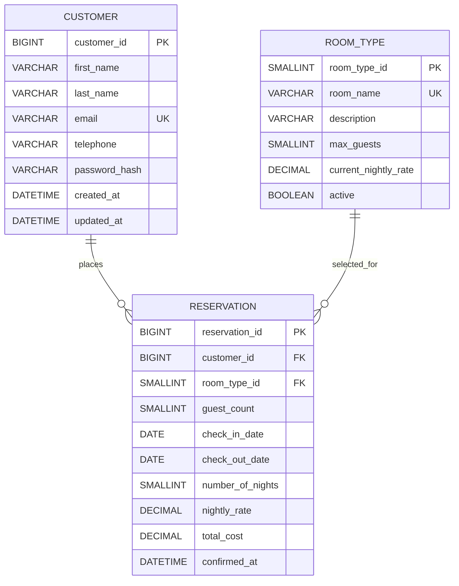

# Technical Design Document

## Moffat Bay Lodge Website Reservation System

| Document detail | Value |
| --- | --- |
| Project | Project 1: Moffat Bay Lodge |
| Prepared by | Group B: Alexander Hunt, Justin Morrow, Noor Al Salihi, and Carli McAvoy |
| Course | Capstone in Software Development |
| Version | 1.4 |
| Date | August 28, 2026 |
| Instructor | Christine Mazhata |
| Team leader | Alexander Hunt |

## 1. Introduction

This Technical Design Document (TDD) defines the scope, users, functional needs, priorities, and estimated work for the Moffat Bay Lodge website.

### 1.1 Purpose

The Moffat Bay Lodge website provides visitors with public information about the lodge and island attractions while supporting secure customer registration, login, vacation booking, and reservation lookup. Visitors may browse all marketing and informational pages without an account. Registered customers must authenticate before confirming and submitting a reservation. Each reservation records its guest count.

The system will:

- Present public Landing, About Us, Contact Us, and Attractions pages.
- Allow customers to register with a unique customer ID and validated account information.
- Authenticate customers by email address and password and maintain the logged-in user in the application session.
- Allow authenticated customers to select a room size, number of guests, and check-in/check-out dates.
- Calculate lodging totals from the selected nightly rate and stay length.
- Display a reservation summary that customers can cancel or confirm before database insertion.
- Store registered customers and confirmed reservations in MySQL.
- Allow reservation lookup by reservation ID or customer email address.

Payment processing is outside the current scope. A reservation is final when the authenticated customer confirms it and the application successfully inserts the record into MySQL.

### 1.2 Terminology

| Term | Definition |
| --- | --- |
| Authentication | Validating a customer's email address and password before granting account access. |
| Authorization | The rule that only logged-in customers may submit a lodge reservation. |
| Customer | A registered person with a persistent account, unique customer ID, email address, and password hash. A customer must authenticate before confirming and submitting a reservation. |
| Guest | A person who occupies the room during a reservation. A guest does not require a customer account and may be the booking customer or another occupant. |
| Guest count | The total people occupying the reserved room, including the customer when staying at the lodge. |
| Visitor | An unauthenticated person browsing the public website. A visitor may view information and begin registration, but cannot confirm or submit a reservation. |
| Customer ID | A unique identifier assigned to each registered customer. |
| ERD | Entity-relationship diagram; a model showing database entities, attributes, and relationships. |
| Hashing | A one-way security process that stores passwords without retaining plaintext. |
| Kanban board | A visual work board for To Do, In Progress, and Done tasks. |
| MySQL | The required relational database for customer and reservation records. |
| Reservation ID | A unique identifier assigned to each confirmed reservation. |
| Session | Server-managed state that identifies a logged-in customer across requests. |
| Story hours | Estimated person-hours required to complete a user story or implementation task. |
| User persona | A fictional profile representing a major type of system user. |
| User story | A short requirement written from a user's perspective and tied to a benefit. |
| Validation | Checks that ensure submitted data meets format and business rules before processing. |

### 1.3 User Personas

#### Persona 1: Maya Chen, First-Time Vacation Planner

| Attribute | Description |
| --- | --- |
| Role | Visitor who becomes a registered customer |
| Background | 34; planning a four-night island trip for herself and her partner; comfortable using travel websites on a phone or laptop. |
| Goals | Understand the lodge and nearby activities, compare room options, create an account, and book confidently. |
| Needs / frustrations | Unclear pricing, hidden account requirements, confusing date forms, and uncertainty about whether a booking was saved. |

#### Persona 2: Daniel Ruiz, Returning Customer

| Attribute | Description |
| --- | --- |
| Role | Registered customer |
| Background | 47; previously stayed at the lodge and wants a fast repeat booking experience; moderately comfortable with technology. |
| Goals | Log in quickly, reserve a room, and retrieve a previous reservation while coordinating travel details. |
| Needs / frustrations | Forgotten reservation IDs, repeated data entry, unclear confirmation states, and difficulty finding prior bookings. |

#### Persona 3: Priya Patel, Detail-Oriented Group Organizer

| Attribute | Description |
| --- | --- |
| Role | Customer / trip organizer |
| Background | 29; coordinates a small group vacation and compares capacity, dates, activities, and cost before committing. |
| Goals | Confirm room configuration, guest count, dates, total lodging cost, and island activities before submission. |
| Needs / frustrations | Insufficient summaries, accidental submissions, no cancel/edit path, and incomplete reservation details. |

### 1.4 User Stories

High-priority stories are essential to booking. Medium-priority stories support discovery or retrieval. Low-priority stories improve general information access. US-01 through US-03 are the top three stories and are estimated in detail in Section 1.5.

| ID | Persona | Priority | User story |
| --- | --- | --- | --- |
| US-01 | Maya Chen | High | As a first-time visitor, I want to register with validated contact and password information so that I can create an account and become eligible to reserve a room. |
| US-02 | Daniel Ruiz | High | As a registered customer, I want to log in with my email address and password so that I can securely access the reservation workflow. |
| US-03 | Priya Patel | High | As a group organizer, I want to select a room, guest count, and stay dates and review the calculated summary before confirming so that I can submit an accurate reservation. |
| US-04 | Maya Chen | Medium | As a first-time visitor, I want to compare offered room configurations and nightly rates so that I can choose an option that fits my trip. |
| US-05 | Maya Chen | Low | As a first-time visitor, I want to view lodge details, contact information, and island attractions without logging in so that I can decide whether to visit. |
| US-06 | Daniel Ruiz | Medium | As a returning customer, I want to look up reservations by reservation ID or email address so that I can retrieve my stay details. |
| US-07 | Daniel Ruiz | Medium | As a returning customer, I want a clear confirmation after submission so that I know my reservation was stored successfully. |
| US-08 | Priya Patel | Medium | As a group organizer, I want the reservation summary to show room size, guest count, check-in/check-out dates, nights, and total cost so that I can verify every detail. |
| US-09 | Priya Patel | Medium | As a group organizer, I want to cancel from the summary and return to the reservation form so that I can correct selections without saving an unwanted reservation. |

### 1.5 Work Estimations (To-Do List)

**Estimation basis:** Story hours are person-hours for implementation, developer testing, and integration within a student-team workflow. Adjust estimates for the technology stack and team availability.

#### Top Three User Story Breakdown

##### US-01: Secure Customer Registration (13 hours)

| Step | Estimated hours |
| --- | ---: |
| Define customer model and MySQL table, including unique `customerId` and email | 2 |
| Build registration form for email, first name, last name, telephone, and password | 2 |
| Implement server-side required-field and standard email-format validation | 2 |
| Implement password validation: 8+ characters, uppercase, lowercase, and number | 2 |
| Hash password and insert valid customer; handle duplicate email | 3 |
| Test valid, invalid, and duplicate registration cases | 2 |
| **Story total** | **13** |

##### US-02: Customer Login and Session (10 hours)

| Step | Estimated hours |
| --- | ---: |
| Build login form using email as username and password | 1.5 |
| Query customer by normalized email and verify password hash | 2.5 |
| Create authenticated session and protect reservation submission | 2.5 |
| Add clear invalid-credentials and logged-in states | 1.5 |
| Test successful login, failed login, session persistence, and access control | 2 |
| **Story total** | **10** |

##### US-03: Reservation Selection, Summary, and Confirmation (18 hours)

| Step | Estimated hours |
| --- | ---: |
| Define reservation model and MySQL table with customer relationship | 2.5 |
| Build reservation form for room size, guests, and check-in/check-out dates | 3 |
| Validate dates, guest count, authentication, and allowed room options | 2.5 |
| Calculate nights and price using the selected nightly room rate | 2 |
| Build summary page with cancel and confirm actions | 2.5 |
| Insert only confirmed reservations and return a reservation ID | 2.5 |
| Test pricing, validation, cancel, confirmation, and database persistence | 3 |
| **Story total** | **18** |

#### Kanban To-Do List

| ID | Area | Kanban task | Suggested owner | Hrs | Priority | Story |
| --- | --- | --- | --- | ---: | --- | --- |
| TD-01 | Project setup | Create repository/project skeleton, shared conventions, and environment configuration | Team lead / developer | 3 | High | US-01-US-09 |
| TD-02 | Database | Create MySQL customer and reservation tables, keys, constraints, and seed/test data | Database developer | 5 | High | US-01, US-03, US-06 |
| TD-03 | Public pages | Build responsive public pages; include hiking, kayaking, whale watching, and scuba diving | Front-end developer | 8 | Low | US-05 |
| TD-04 | Registration | Implement registration UI, validation, unique-email handling, and password hashing | Full-stack developer | 11 | High | US-01 |
| TD-05 | Registration testing | Test required fields, email format, password policy, duplicate email, and insertion | QA / developer | 2 | High | US-01 |
| TD-06 | Login/session | Implement login, hash verification, session, logout, and protected booking submission | Back-end developer | 8 | High | US-02 |
| TD-07 | Login testing | Test successful/failed login, persistence, logout, and unauthenticated redirect | QA / developer | 2 | High | US-02 |
| TD-08 | Room selection | Build booking form with room sizes/rates, guests, and stay dates | Front-end developer | 5 | High | US-03, US-04 |
| TD-09 | Reservation logic | Implement validation, calculations, customer relationship, and reservation ID | Back-end developer | 6 | High | US-03, US-08 |
| TD-10 | Summary/confirmation | Build summary with cancel/confirm; save only after confirmation | Full-stack developer | 4 | High | US-03, US-07-US-09 |
| TD-11 | Reservation testing | Test room rates, date ranges, totals, cancel path, confirmation, and insertion | QA / developer | 3 | High | US-03 |
| TD-12 | Reservation lookup | Search by reservation ID or email; display room, guests, and dates | Full-stack developer | 6 | Medium | US-06 |
| TD-13 | Lookup testing | Test found, not found, multiple results, and invalid input | QA / developer | 2 | Medium | US-06 |
| TD-14 | Integration/accessibility | Connect workflows; review labels, keyboard use, responsive layout, and errors | Whole team | 5 | Medium | All |
| TD-15 | Documentation/review | Review requirements, update TDD/Kanban, cite sources, and prepare demo | Team lead / whole team | 4 | Medium | All |

**Estimated initial backlog:** 74 person-hours. The detailed top-three estimates total 41 hours.

#### Definition of Done for Kanban Tasks

- Implementation satisfies the linked user story and stated project requirement.
- Input validation and expected error handling are included.
- The task is integrated with the shared project and does not break existing workflows.
- Relevant tests or documented manual checks pass.
- Externally reused code is cited according to course requirements.
- At least one teammate reviews the work before the card moves to Done.

## 2. Design

### 2.1 Prototypes

#### Design Decisions

| Decision | Selection |
| --- | --- |
| Prototyping tool | Wireframe |
| Heading and title font | Libre Baskerville |
| Content font | Source Sans 3 |
| Color palette | `#314D58`, `#536269`, `#775B46`, `#855950`, `#AEBBB2`, `#EDEBDF` |

#### Prototypes and Mockups

**Brand assets:** Logo concept (not included in the source export).

**Landing page mockup:** A high-fidelity mockup demonstrating a complete home-page experience with a call to action, navigation controls, featured attractions, and a footer.

#### Page Prototypes

| Page | Wireframe |
| --- | --- |
| Landing Page | [Wireframe](https://wireframe.cc/pro/ppp/baf3ed2f4-1012072) |
| About Us Page | [Wireframe](https://wireframe.cc/pro/ppp/baf3ed2f4-1012072#77f89b48-1de9-4b0e-be5c-5673c30e4b7f) |
| Contact Us Page | [Wireframe](https://wireframe.cc/RLrHt8) |
| Attractions Page | [Wireframe](https://wireframe.cc/bxvKn7) |
| Login and Registration Page | [Wireframe](https://wireframe.cc/Hfh5L4) |
| Reservation Page | [Wireframe](https://wireframe.cc/4upHTU) |

### 2.2 ERD

The ERD below reflects the current Flask application's SQLAlchemy models and Alembic migrations. A customer places zero or more reservations, and a room type is selected for zero or more reservations.

## 3. QA Testing

### 3.1 QA Test Plan

Not included in the source export.